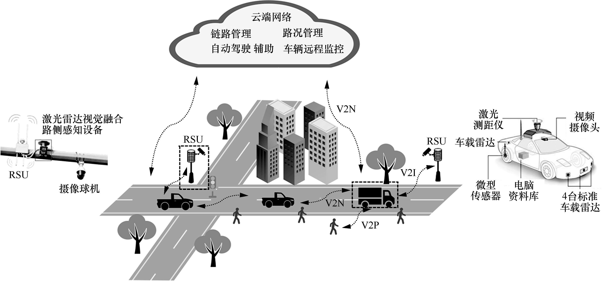
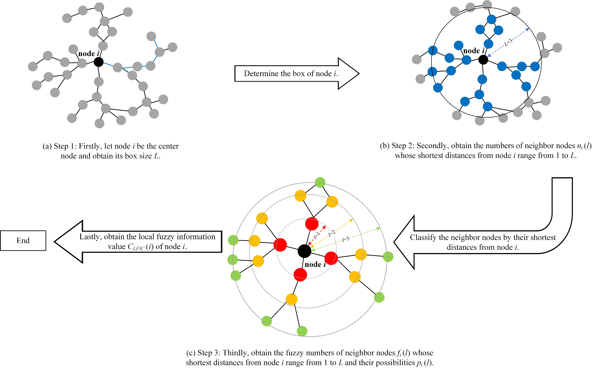
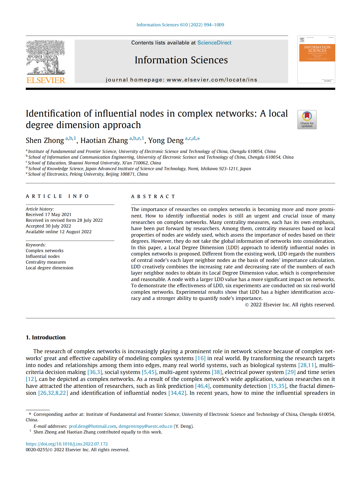

# About Me

**I'm now a Ph.D. student of *School of Electronics, Peking University* under the supervision of [Dr. Xiang Cheng](https://sites.google.com/site/xchengpku/home ).**

# Interests

**My research interests include**

* **Multi-modal Sensor Fusion and Its Application in Transceiver Design**: The fusion of multi-modal sensory data assisted predictive beamforming and channel estimation in Vehicular Communication Networks
* **Multi-modal Information Assisted Resource Allocation in Large-Scale Multi-Agent Scenarios**:  Multi-modal sensory data assisted load forecasting and communication resource allocation

# Education

### - Ph.D in Information and Signal Processing
#### _2022/-09-2027/06 (expected)_
  * **Peking University, Beijing**

### - Bachelor of Network Engineering
#### _2018/09-2022/06_
  * **University of Electronic Science and Technology of China, Chengdu**

# Publications
<table border="2">
  <tr>
    <td width="75%">
      
<b>车联网通信感知一体化研究：现状与发展趋势</b>

      
<small>X.Cheng, <b>Haotian Zhang</b>, Z.Yang, Z.Huang, S.Li, A.Yu </small>

      
<small><b>通信学报, 2022</b></small>

      <a href="http://www.infocomm-journal.com/txxb/CN/10.11959/j.issn.1000-436x.2022137">Paper</a>
    </td>
    <td width="25%">
      
    </td>
  </tr>
</table>

<table border="2">
  <tr>
    <td width="75%">
       
<b>LFIC: Identifying influential nodes in complex networks by local fuzzy information centrality</b>

       
<small><b>Haotian Zhang</b>, S.Zhong, Y.Deng, KH.Cheong </small>

       
<small><b>IEEE Transactions on Fuzzy Systems (TFS), 2021</b></small>

       <a href="https://ieeexplore.ieee.org/abstract/document/9537594/">Paper</a>
    </td>
    <td width="25%">
      
    </td>
  </tr>
</table>

<table border="2">
  <tr>
    <td width="75%">
      
<b>Identification of influential nodes in complex networks: A Local Degree Dimension Approach</b>

      
<small>S.Zhong, <b>Haotian Zhang</b>, Y.Deng </small>

      
<small><b>Information Sciences, 2022</b></small>

      <a href="https://www.sciencedirect.com/science/article/abs/pii/S0020025522008672">Paper</a>
    </td>
    <td width="25%">
      
    </td>
  </tr>
</table>

# Projects

### The research of identification of influential spreaders in complex networks
#### _2020/9-2021/05_
* Attend a highly collaborative project focused on the mining of influential nodes in complex networks and fuzzy theory.
* Put forward the concept that inner structure in a node’s box contains information about its importance in complex networks and proposed LFIC algorithm. Combined the global information of networks with the nodes’ degree changing rates and proposed LDD algorithm.

### Research on anomaly detection based on Unsupervised Machine Learning in Wireless Sensor Networks	
#### _2019/10-2020/10_
* Attend a highly collaborative project focused on the detection of anomalous attackers in WSNs.
* Applied the Density Based Clustering (DPC) algorithm to the detection of anomalous behavior in WSNs, and proposed the NB-DPC algorithm to detect the selective forwarding attack in WSNs.
* The work has gotten national patent. (Patent number: CN112929879A)

# Awards

### Honours Bachelor Degrees of UESTC
#### _2022/6_

### National Scholarship
#### _2020/10_

### Provincial First Prize in CUMCM
#### _2020/10_

### National Second Prize in NECCS
#### _2021/5_

### National Third Prize in NECCS
#### _2020/10_

### Honorable Mention of 2021 Mathematical Contest in Modeling (MCM)
#### _2021/5_

# Contact Me

**Email:** haotianzhang@stu.pku.edu.cn
